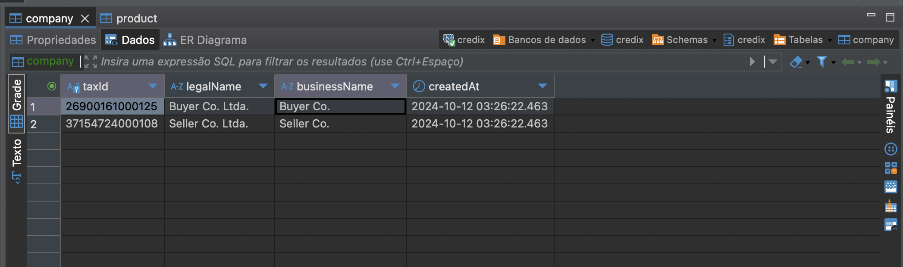
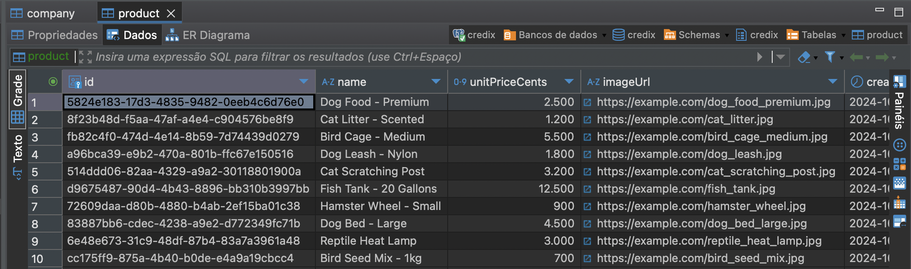
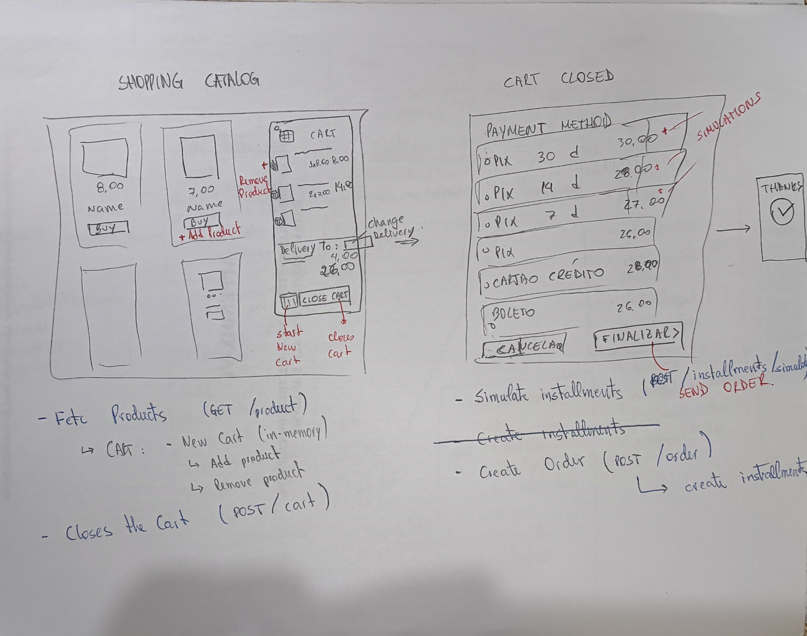

<p align="center">
  <a href="http://nestjs.com/" target="blank"></a>
</p>

[circleci-image]: https://img.shields.io/circleci/build/github/nestjs/nest/master?token=abc123def456
[circleci-url]: https://circleci.com/gh/nestjs/nest

# Checkout API (credix)

Fullstack developer testing

## Project setup
1. Fulfill your `.env` file

2. Create a new database instance with Docker

```bash
$ docker compose up -d
```

3. Setup a new Schema following the name fulfilled in `DATABASE_SCHEMA` env variable

4. Run seeder to populate some entities into the database

```bash
$ npm run seed
```

## Compile and run the project

```bash
$ npm run start
```

5. You can use Swagger Docs API to manipulate the API in http://localhost:3000/docs

## Run tests Manually

Before testing, ensure to populate database with initial data (execute `npm run seed`). This shall:
- Create new Products
  
- Create two new companies (buyer, seller)
  

The frontend would probably look something like the following mockup, with some features highlighted (not implemented)



Although not implemented, the workflow might be simulated through [Swagger Docs API](http://localhost:3000/docs) or calling HTTP methods using Insomnia or Postman.

### Simulation steps

1. User starts a new shopping list

  - Fetch available products for selling:
    - Frontend fetches data using a `GET` request to `/products`
  
2. User adds products to the cart (Add products to Cart)

  - Frontend checks if buyer has a opened Cart through `GET` `/carts/buyer/{id}`.
      - If so, fetches its data and products through `GET` `/carts/{id}`.
      - If not, create a new one through a `POST` `/carts` 

  - Frontend adds the product to cart through `POST` `/carts/add-product/{cartId}/{productId}`

3. User removes a product from the cart (Remove product from Cart)
  - Frontend removes the product through `POST` `/carts/remove-product/{cartId}/{productId}`

  - At any iteration (add/remove), frontend should calculate cart total amount (including taxes amount) through `POST` `/carts/calculate-values/{id}`

4. User checks out
  - Frontend closes the cart `POST` `/carts/close/{id}` and generate a new **internal Order** with *pending_payment_method* status;
  - Frontend simulates taxes and values for each available payment method. To simulate Credix BNPL, uses a `POST` to `/orders/simulate-payment`
  - Loads **Choose payment method** page rendering each payment method conditions and total values;

8. User select payment type and submit order to Credix API
  - Frontend updates **internal order** payment method and values and store current Credix Order into **internal order database** through `POST` `/orders/submit`